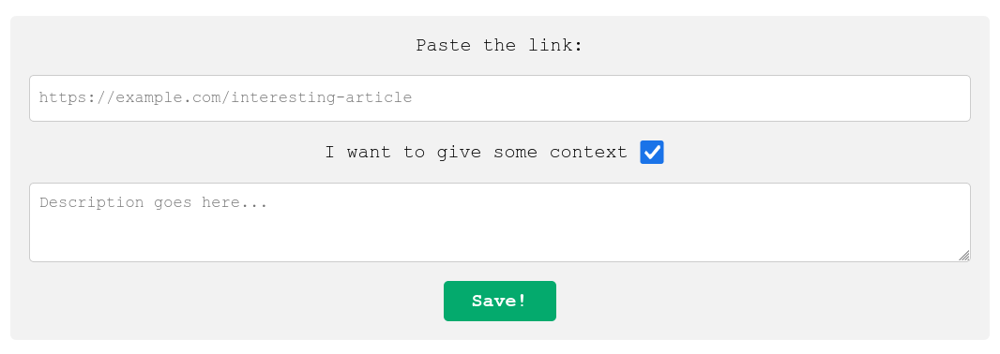

# ReadLaterRSS

Your *read later* list is now an RSS feed!

Just like [Pocket](https://getpocket.com/). But simpler.

## Motivation

There are times when you want to save internet articles for later, but having a separate file or an app to read them feels uncomfortable. **ReadLaterRSS** helps to integrate your list into any RSS reader you already use.

Since version 2, text-only feeds with automatic translation by [LibreTranslate](https://libretranslate.de/) are supported. Currently Deutsch to English only.

## Usage

### Starting the server

```bash
git clone https://github.com/studokim/ReadLaterRSS.git
cd ReadLaterRSS
go get github.com/studokim/ReadLaterRSS
go build
./ReadLaterRSS --listen <port> --website <yoursite.com> --author <your.name>
```

Now subscribe to the new feed using your RSS reader: the address is `localhost:port/rss`.

### Adding articles

Go to `localhost:port/add`, paste the url of the article and click `Add!`. The link will be converted to an RSS item and appended to the feed. If any error occurs, it will be shown immediately.

All the articles are saved into `history.yml` with the timestamp, so you may restart the server anytime preserving the feed state.

## Screenshots


